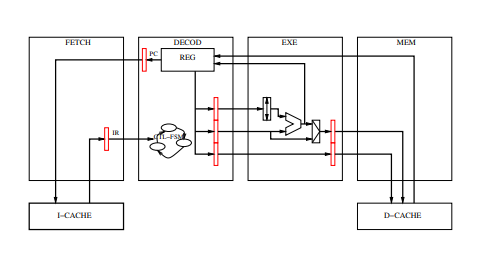
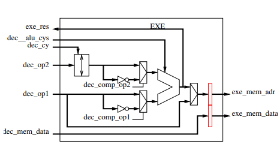
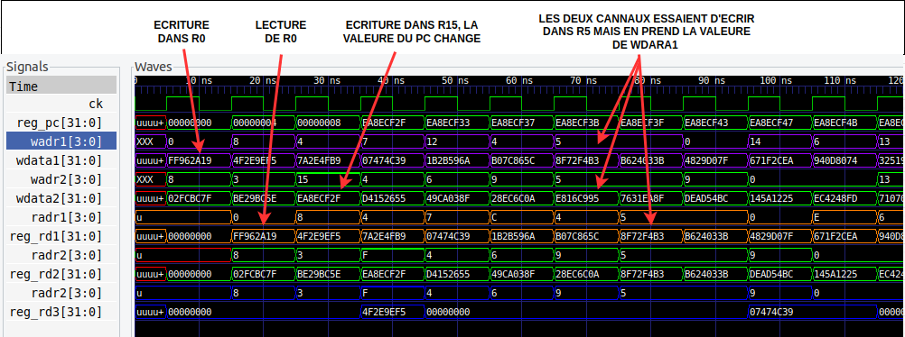
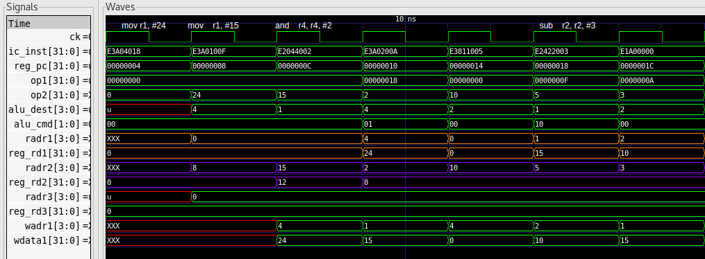

## Introduction
Dans le cadre de ce projet, l'objectif est de détailler le design d'un processeur basé sur l'architecture ARM. La finalité est que ce processeur puisse exécuter de manière complète un programme écrit en langage assembleur ARM. Cette modélisation est réalisée en utilisant le langage de description matérielle VHDL.

Le CPU que l’on modélise est un processeur pipeline sur 4 étages :

<center>



</center>

* **FETCH** : Cet étage récupère l'instruction en mémoire et la transmet à l'étage de décodage.
* **DECOD** : À ce stade, l'instruction chargée par l'étage Fetch est décodée. Cela implique la sélection des opérandes, des registres et des calculs nécessaires à son exécution. L'étage de décodage inclut également la gestion du banc de registres.
* **EXE** : Cette phase se consacre à l'exécution des opérations arithmétiques de base.
* **MEM**: Si l'instruction exécutée nécessite des accès mémoire, cet étage s'occupe de les effectuer.


## EXE
La première étape de notre modélisation concerne l’étage EXE, qui est assez simple à concevoir. Il se compose principalement de deux éléments essentiels : l'ALU (Unité Arithmétique et Logique) et le shifter. Voici une description de son organisation :

<center>


</center>

## DECOD
DECOD représente la phase la plus cruciale et complexe du processeur. Sa responsabilité principale est de décoder les instructions provenant de l'unité IFETCH. De plus, il joue un rôle essentiel dans la gestion globale du pipeline en commandant les différents étages après avoir interprété l'instruction reçue. Cet étage se divise essentiellement en deux parties : le banc de registres, et le décodage des instructions et le contrôle général du processeur (machine à états). 

<center>

</center>

## Tests

Nous avons effectué des vérifications à chaque étage du pipeline du processeur après sa réalisation. Pour cela, nous avons écrit des tests bench individuels pour garantir leur bon fonctionnement. Ces tests incluaient des assertions, avec des nombres aléatoires introduits en entrée et la vérification des sorties.

Par exemple, pour tester l'unité arithmétique et logique (ALU), nous avons injecté deux opérandes et une commande aléatoires, puis vérifié le bon fonctionnement de l'ALU. Pour le banc de registres (REG), nous avons injecté des signaux aléatoires de 32 bits en entrée et vérifié la cohérence des valeurs lues. Nous avons également assuré la priorité d'écriture pour les canaux concurrents et vérifié le bon fonctionnement des instructions de branchement en inscrivant des valeurs spécifiques dans le registre du compteur de programme (pc).




## Validation

Afin de valider le bon fonctionnement intégral du processeur, nous avons réalisé des tests avec un code en assembleur ARM, incluant des instructions de calcul telles que l'ADD. En analysant la sortie sur GTKWave, lors du premier cycle, l'étage IFETCH récupère l'instruction encodée en HEXA. La valeur du compteur de programme (PC) est initialisée à 0 durant ce cycle. Au cycle suivant, l'étage DECODE prépare les opérandes nécessaires (opérandes 1 et 2, ainsi que le registre de destination) et les commandes pour la transition vers l'étage EXE (la commande pour l'ALU indiquant une opération d'addition, sans besoin du complément à 2 ni du shift pour nos opérandes). Dans le cycle suivant, la nouvelle valeur calculée par l'étage EXE est correctement écrite dans le registre de destination du banc de registres.


Ci-dessous, vous trouverez un extrait de code écrit en langage assembleur ARM, accompagné des résultats visibles sur GTKWave.


```asm
00000000 <_start>:
   0:    e3a04018     mov    r4, #24
   4:    e3a0100f     mov    r1, #15
   8:    e2044002     and    r4, r4, #2
   c:    e3a0200a     mov    r2, #10
  10:    e3811005     orr    r1, r1, #5
  14:    e2422003     sub    r2, r2, #3
  18:    e1a00000     nop   		
  1c:    e1a00000     nop 
  
```




